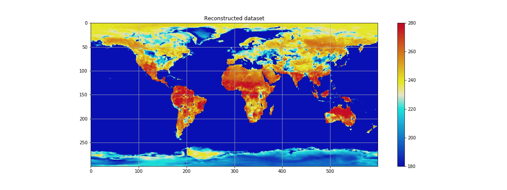

# The image slurper
Are you **tired** of asking people for the data behind their published false color plots? Use the image slurper to reconstruct the underlying matrix of values from a false-color (heat map) image and its colorbar! 

The image slurper can be used on many types of false color plots, and works best on relatively smooth data.

The image slurper is an Jupyter worksheet `imageslurper.ipynb` that takes an image like this

and reconstructs the original pixel values by comparing each pixel to the colors of the colorbar, giving a result like below.

 

The brute force algorithm used is based on this Stack Overflow answer: ["Digitize a colormap"](https://stackoverflow.com/a/43844204/3198895).