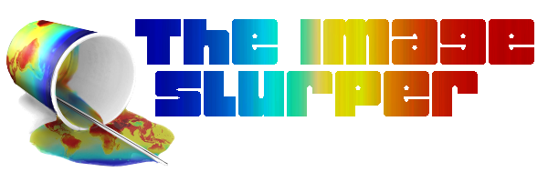

[](https://opensource.org/licenses/MIT)


Are you **tired** of asking people for the data behind their published false color plots? Use the image slurper to find the underlying matrix of values from a false-color (heat map) image and its colorbar! 

The image slurper can be used on many types of false color plots, and works best on relatively smooth data.

The image slurper is a [Jupyter notebook](imageslurper.ipynb) that takes a a false-color image like this one:


Use the mouse to indicate the image area and colorbar area:

<p align="center">
  
</p>


and let the image slurper find the original pixel values by comparing each pixel to the colors of the colorbar, 
giving a `numpy` array
```python
array([[232.39477504, 234.42670537, 234.86211901, ..., 234.86211901,
        234.42670537, 233.84615385],
       ...,
       [206.85050798, 207.28592163, 207.57619739, ..., 208.30188679,
        207.28592163, 209.17271408]])
```
and an associated error estimate, which cmay be plotted with `matplotlib`:


## Comparison with original
The reconstructed image can be plotted using the same colorbar as the original image:


For a well executed slurp the input image plot areas should be visually indistinguishable from the result plot area.

The brute force algorithm used is based on this Stack Overflow answer: ["Digitize a colormap"](https://stackoverflow.com/a/43844204/3198895).